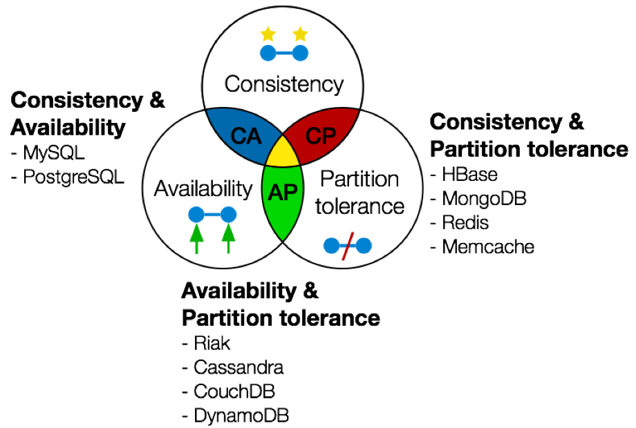

# BBDD NOSQL con Cassandra

## Introducción

---

En temas de volúmenes las bbdd no escalan horizontalmente, solo verticalmente (No permiten añadir más nodos)

Lo bueno de las bbdd nosql es que son muy escalables, pero tiene que ser muy especializadas.

- **Ficheros**: tecnologias para guardarlos: hadoop y amazons3.
- **Key-Value store**: bbdd columnares. Es para alamacenar arrays asociativos, es decir diccionarios. Hay que tener muy claro como acceder a los datos. Son muy escalables. Tecnologias: cassandra, dynamoDB, apache HBASE y BigTable.
- **Document Store**: esta lo que facilita es que está pensada en almacenar documetnos tipo json o xml. Como principal ventaja tiene que se puede acceder a los datos de manera flexible y otra de sus ventajas es que puede llamar a los datos directamente como si fuera un endpoint, no se necesit el desarrollo back,, te lo devuelve directamente en json. Tecnologias: MongoDB, MarkLogic y Cloud Firestore.
- **Graph Database**: un grafo es un conjunto de nodos, enlaces y propiedades. Al hacer las búsquedas de datos te lo representa graficamente, lo que es mucho más visual. Tecnologias: neo4j y amazon Neptune.
- **In-Memory Database**: bbdd en memoria tienen la ventaja de que están en la propia memoria, los demas lo guardan en disco. La ventaja principal es que es muchísimo más rápido acceder a los datos. La memoria es mucho más cara. PAra hacer procesado en tiempo real es muy bueno. Tecnologias: hazelcast, apache Ignite, Allucio y redis.
- **Indexed**: muy similar a las bbdd documentales. La diferencia es que en estas todos los datos se indexan en el momento que se insertan. Hace un preprocesado para que luego al buscarlo sea mucho más eficiente. Tecnología: elasticsearch y solr.

### **Toerema CAP**

## Cassandra

---

BBDD Key-Values.

Accedemos por una clave y luego tenemos sus valores. Normalmente las columnas son dinámicas. Puede haber lineas con unas columnsa y otras lineas con otro numero de columnas.

El acceso a los datos es muy rápido, y a estos datos se accede siempre por las claves.

**Características principales:**

1. Performant
2. Scalable
3. Elastic
4. Control
5. Decentralized
6. Fault Tolerant

**¿Cuándo usamos cassandra?**

- Cuando el número de escrituras es mayor al de lecturas.
- Los datos raramente se actualizan. Ejemplo: IOT.
- Leemos conociendo la clave.
- Los datos se pueden particionar.
- Cuando no se hacen ni joins ni agreagiciones (group by).

**Keyspace**: dentro estará un conjunto de tablas

**Tablas**: cada tabla tiene su clave y sus valores. PAra cada fila que guardamos también se guarda un timestamp.

### **Primary Keys:**

- Partition Key: es para identificar la partición o el nodo en el cluster. Nos dice como trocear los datos para que se dividan en las particiones. Es importante para equilibrar las cargas.
- Clustering Key:  nos indica como ordenamos los datos.

## Success Stories

---
