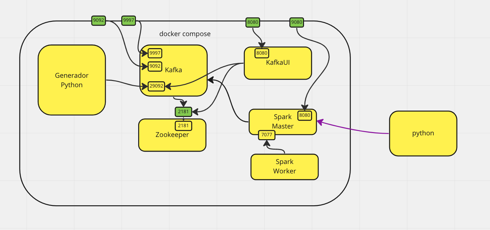

# EDEM_E2E
E2E for EDEM Students

# Para inicializar el cluster

Le pedimos a docker que nos ejecute contra el contenedor del master con las librerias que le decimos el siguiente script

`docker exec e2e-spark-master-1 /opt/spark/bin/spark-submit --master spark://spark-master:7077 --jars /opt/spark-apps/postgresql-42.2.22.jar --packages org.apache.spark:spark-sql-kafka-0-10_2.12:3.0.2 --driver-memory 1G /opt/spark-apps/main.py`